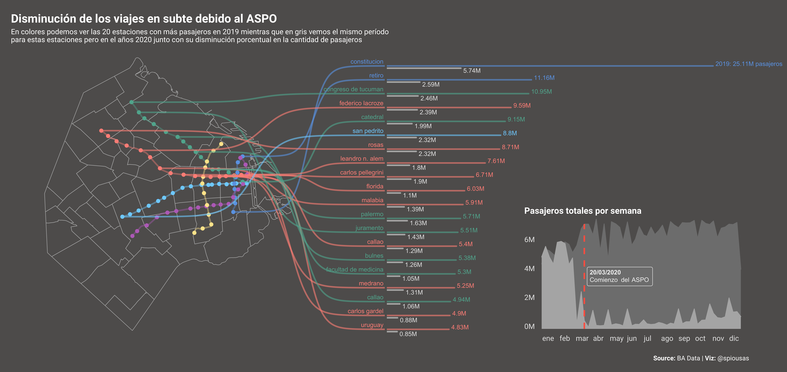
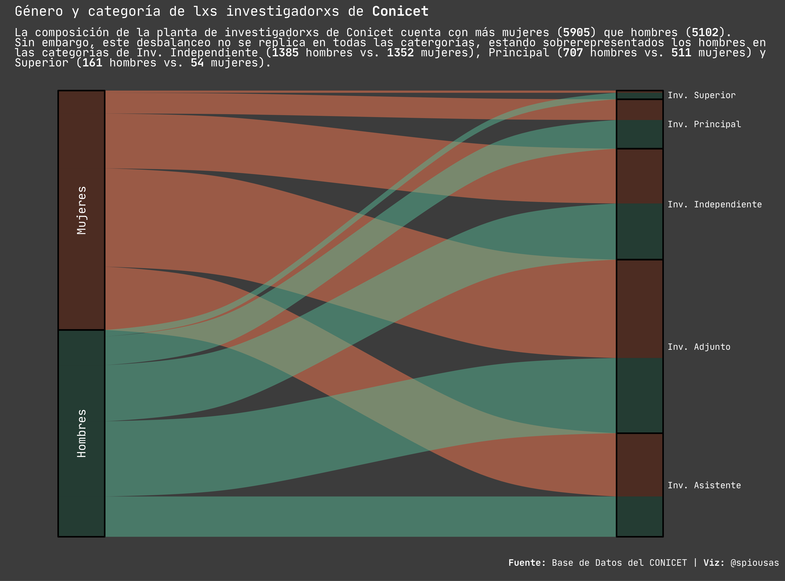

```{r setup, include=FALSE}
library(emo)
library(png)
library(tidyverse)
library(knitr)
knitr::opts_chunk$set(
  collapse = TRUE,
  echo = TRUE,
  comment = "#>",
  fig.path = "man/figures/README-",
  out.width = "100%",
  dpi = 800
)
options(tibble.print_min = 5, tibble.print_max = 5)
```

# Wellcome to my randomViz github repo!!! 

[](https://twitter.com/spiousas)

Where I learn about DataViz by stealing from the VizWizes.

I am a neuroscientist/viz-enthusiast based in Buenos Aires, Argentina. You will find vizualizations and texts both in Spanisha nd English.


## Subway passengers in Buenos Aires

Comparative of subway passangers in Buenos Aires before and during the Covid-19 pandemics.
```{r, echo = FALSE}

```
[Code here](https://github.com/spiousas/random_Viz/blob/main/BAmetro/bump_estaciones.R)

## Conicet

Género y categoría de lxs investigadorxs de Conicet.
```{r, echo = FALSE}

```
[Code here](https://github.com/spiousas/random_Viz/blob/main/Conicet/AlluvialConicet.R)

## Covid Vaccines

Vaccines and GDP
```{r, echo = FALSE}
include_graphics("./Covid_vaccines/output/vaccine_GDP.png")
```
[Code here](https://github.com/spiousas/random_Viz/blob/main/Covid_vaccines/vaccines_and_GDP.R)

## Copa América

Winners of the Copa América soccer tournament.
```{r, echo = FALSE}
include_graphics("./Copa_America/historico/output/copa_america_historico.png")
```
[Code here](https://github.com/spiousas/random_Viz/blob/main/Copa_America/historico/copa_america_historico.R)


